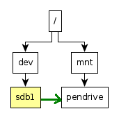

## 리눅스 파일시스템

GNU/Linux에서 가장 먼저 이해해야 할 것 중 하나는 바로 그 파일시스템입니다. 리눅스 파일시스템은 UNIX 규칙을 따르며 꽤 직관적입니다. 하지만 Windows에 익숙한 경우라면 새롭게 이해해야 할 부분이 있습니다.

(여기서 말하는 파일시스템은 디스크에 사용되는 특정 파일시스템 형식(ext4, FAT 등)을 의미하는 것이 아니라, 리눅스 경로가 어떻게 구성되고 파일이 어떻게 다뤄지는지를 의미합니다.)

---

### 가장 기본적으로 리눅스 파일시스템은 단일 트리 구조를 가집니다

하나의 루트(root)가 있으며 모든 파일과 폴더는 그 아래에 가지처럼 연결됩니다. Windows처럼 드라이브 문자가 따로 있는 것이 아니라 저장 장치 역시 동일한 트리 구조에 연결됩니다.

---

### 리눅스에서는 모든 것이 파일이다

조금 혼란스러워 보일 수 있지만 사실은 단순한 개념입니다. 데이터 파일, 장치, 프로세스 등이 모두 파일처럼 취급됩니다. 사용자는 동일한 방식으로 접근할 수 있어 관리가 훨씬 단순해집니다.

예를 들어 저장 장치를 복제하려면 해당 장치를 나타내는 파일을 그대로 복사하면 됩니다. 심지어 파일을 저장 장치(가상 디스크)처럼 사용할 수도 있습니다. 아주 간단합니다.

---

### 모든 파일과 폴더는 동일한 계층 구조의 일부이다

리눅스 파일시스템 트리


그림: 리눅스 파일시스템 트리 예시

그림에서 볼 수 있듯이 루트 디렉터리는 단 하나뿐입니다. 모든 파일과 폴더는 그 아래에 있습니다.

장치 또한 이 계층 구조의 일부로 간주됩니다. 장치에 접근하려면 장치를 폴더에 연결해야 하며, 이 과정을 **마운트(mount)** 라고 합니다.

---

### 경로(Path)

경로는 리눅스 파일시스템에서 파일이나 폴더의 위치를 나타내는 표기법입니다. 경로에는 절대 경로와 상대 경로 두 가지가 있습니다.

* **절대 경로(Absolute path)**: 루트 디렉터리부터 시작하는 전체 경로

  ```
  /home/user-1/folder-1/file.txt
  ```

* **상대 경로(Relative path)**: 현재 디렉터리를 기준으로 한 경로

  ```
  folder-1/file.txt
  ```

경로가 폴더임을 구분하기 위해 끝에 `/`를 붙이기도 하지만 필수는 아닙니다.
예: `/home/user-1/folder-1/`

---

### 마운트(Mount)

마운트는 리눅스에서 저장 장치를 접근 가능하게 만드는 과정입니다.

예를 들어 USB 메모리를 연결하면 두 단계가 필요합니다:




1. USB를 연결하면 `/dev/sdb1` 같은 장치 파일이 `/dev` 아래에 생성됩니다. 하지만 이 상태로는 접근할 수 없습니다.
2. `mount` 명령어로 장치를 폴더에 연결해야 합니다. 예:

   ```
   mount /dev/sdb1 /mnt/pendrive
   ```

   이렇게 하면 `/mnt/pendrive` 폴더를 통해 USB 내용에 접근할 수 있습니다.

---

### 권한(Permissions)

리눅스는 다중 사용자 운영체제입니다. 루트(root) 사용자는 시스템의 모든 권한을 가지며, 일반 사용자는 보안을 위해 제한된 권한으로 작업합니다. 권한이 필요한 작업은 `sudo` 명령어를 사용해 실행할 수 있습니다.

각 파일에는 두 가지 소유 정보가 있습니다:

* 사용자(User)
* 그룹(Group)

접근 주체는 세 가지로 나뉩니다:

* 소유자(user)
* 그룹(group)
* 기타(others)

접근 권한은 세 가지입니다:

* 읽기(Read)
* 쓰기(Write)
* 실행(Execute)

예:

```
rwxr-x--x
```

소유자는 모든 권한을 가지며, 그룹은 읽기와 실행만 가능하고, 기타 사용자는 실행만 가능합니다.

권한 확인 명령어:

```
ls -l <파일명>
```

---

### 링크(Links)

리눅스에는 두 종류의 링크가 있습니다:

* **소프트 링크(Soft Link, 심볼릭 링크)**: 다른 위치의 파일을 가리키며, 드라이브 간에도 사용할 수 있습니다.
* **하드 링크(Hard Link)**: 동일한 드라이브 내에서만 사용할 수 있으며, 동일한 데이터에 대한 추가 참조를 제공합니다.

---

### 마치며

리눅스 파일시스템은 단순하지만 완전히 이해하려면 약간의 학습이 필요합니다. 여기서는 기본적인 개념만 다뤘으며, 직접 파일 조작을 해보는 것이 가장 좋은 학습 방법입니다.

